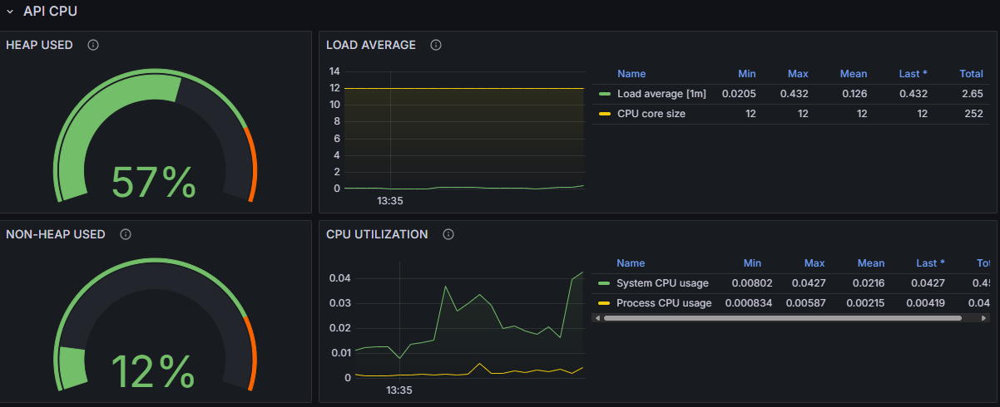
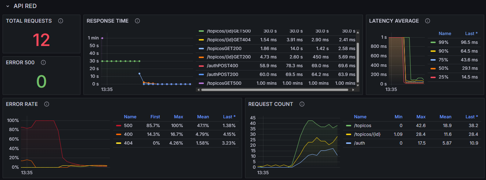

# Dash-Forum-API - Grafana Dashboard

## 📌 Visão Geral
Este repositório contém um dashboard do Grafana exportado, chamado **dash-forum-api**. O dashboard foi projetado para monitorar métricas da API **app-forum-api**, fornecendo uma visão detalhada do desempenho, disponibilidade e uso de recursos.

## 📊 Métricas Monitoradas
O dashboard inclui os seguintes painéis de monitoramento:
- **Uptime da API** - Verifica se a API está online.
- **Conexões com o Banco de Dados** - Estado e número de conexões ativas.
- **Uso de CPU** - Monitoramento do consumo de CPU.
- **Tempo de Resposta** - Análise de latência das requisições.
- **Taxa de Erros** - Percentual de requisições com erro.
- **Tráfego de Rede** - Volume de dados transmitidos e recebidos.

## 🔧 Pré-requisitos
Antes de importar o dashboard, certifique-se de que:
- O **Grafana** está instalado e configurado.
- O **Prometheus** está coletando as métricas da API **app-forum-api**.
- As fontes de dados necessárias estão corretamente configuradas no Grafana.

## 🚀 Como Importar o Dashboard
1. Acesse o Grafana e faça login.
2. Vá para **Dashboards** > **Import**.
3. Faça o upload do arquivo `dash-forum-api.json` ou cole o JSON exportado.
4. Selecione a fonte de dados correta (ex.: Prometheus) e clique em **Import**.
5. O dashboard estará disponível para uso!

## ⚙️ Configuração das Variáveis
O dashboard utiliza variáveis para facilitar a visualização de diferentes instâncias da API. Certifique-se de configurar corretamente:
- `$instance` - Define a instância da API a ser monitorada.
- `$job` - Permite filtrar métricas de diferentes serviços.

## 📷 Exemplos do Dashboard

---

Se tiver dúvidas ou sugestões, sinta-se à vontade para abrir uma issue! 🚀

